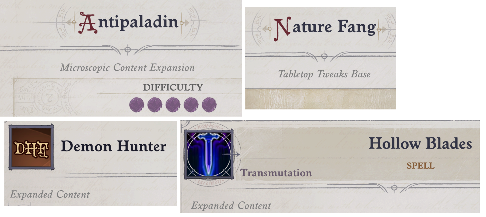

# ModTagEx mod for Pathfinder: Wrath of the Righteous

Displays information about which mod object is from.  

In entity description under the name either mod name or 'Unknown mod' will be displayed in small italic grey font. If you saw Toybox guid display, this is done in same style. Doesn't conflict with ToyBox.

Here's how it looks:

Can show information for:  
- Class in level up interface
- Archetype in level up interface
- Race in level up interface
- Feature in level up interface
- Feature in normal UI
- Ability and spell
- Activatable Ability (disabled by default)
- Buff (disabled by default)
- Item 

Configuration is done through UMM UI.

Recognition is powered using my database from here: https://raw.githubusercontent.com/alterasc/alterasc.github.io/main/all_blueprints.txt

You can enable auto update of database in UMM UI. Then on startup (but no more often than once per day) mod will check if there have been updates to database and download new db version.    
Auto update is disabled by default.

If you want to update manually download file from link above and replace all_blueprints.txt file in mod directory with one downloaded by you.
